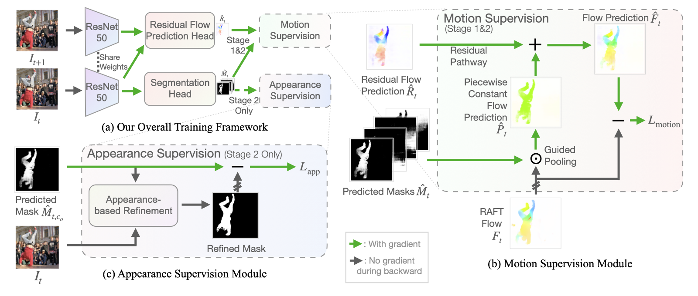

# Segmenting objects in videos **without human annotations**! 😲 🤯

# RCF: Bootstrapping Objectness from Videos by Relaxed Common Fate and Visual Grouping

by [Long Lian](https://tonylian.com/), [Zhirong Wu](https://scholar.google.com/citations?user=lH4zgcIAAAAJ&hl=en) and [Stella X. Yu](http://www1.icsi.berkeley.edu/~stellayu/) at UC Berkeley, MSRA, and UMich

<em>The IEEE/CVF Conference on Computer Vision and Pattern Recognition (CVPR), 2023.</em>

[[Paper](https://arxiv.org/abs/2304.08025)] | [[Project Page](https://rcf-video.github.io/)] | [Colab (Coming soon)] | [[Demo Video](http://people.eecs.berkeley.edu/~longlian/RCF_video.html)] | [[Citation](#citation)]

### **Non-cherry picked** segmentation predictions on all sequences on DAVIS16:


**This GIF has been significantly compressed. [Check out our video at full resolution here.](http://people.eecs.berkeley.edu/~longlian/RCF_video.html)** Inference in this demo is done *per-frame* without post-processing for temporal consistency.

### Our Method in a Figure


## Data Preparation
### Prepare data and pretrained weights
Download [DAVIS 2016](https://graphics.ethz.ch/Downloads/Data/Davis/DAVIS-data.zip) and unzip to `data/data_davis`.

Download [pre-extracted flow from RAFT](https://drive.google.com/file/d/1LHGYaozBGGF879lJd3JqaGQKA7oQBbfm/view) (trained with chairs and things) and decompress to `data/data_davis`.

Download [DenseCL ResNet50 weights](https://cloudstor.aarnet.edu.au/plus/s/hdAg5RYm8NNM2QP/download) to `data/pretrained/densecl_r50_imagenet_200ep.pth`.

<details>
<summary>SegTrackv2 and FBMS59 dataset</summary>

These two datasets have much lower quality and very different aspect ratios across sequences. To make things easier, we resize to 480p (854x480) to have the same input size as DAVIS 2016. For fairness, the testing is still on the original dataset, and we provide both the original and scaled datasets (with flows on the scaled datasets). The configs are mainly designed for DAVIS, and shorter training is recommended for these two datasets. There are also larger inter-run variations on these two datasets compared to DAVIS 2016 since the video quality is lower. Updates for settings and instructions for these two datasets coming soon.

Download [SegTrackv2 with pre-extracted flow](https://drive.google.com/file/d/1_EhVYF81MbJj7PyiJphjjcbEUmDvfDyV/view).

Download [FBMS59 with pre-extracted flow](https://drive.google.com/file/d/1Vom-Z1QKdMxugz0pm2N7Ik8XmtvAbMd6/view).
</details>

### Install dependencies and `torchCRF`
The `requirements.txt` assumes CUDA 11.x. You can also install torch and torchvision from conda instead of pip.

`torchCRF` is a GPU CRF implementation typically faster than CPU implementation. If you plan to use this implementation in your work, see the `tools/torchCRF/README.md` for license.

```
pip install -r requirements.txt
cd tools/torchCRF
python setup.py install
```

We also require `parallel` command from moreutils. If your parallel does not work (for example, the parallel from parallel package), you either need to install moreutils from system package manager (e.g. APT on Ubuntu/Debian) or from conda: `conda install -c conda-forge moreutils`.

## Model Zoo and Prediction Masks
We provide pretrained models and prediction masks. If you intend to work on a custom dataset that is out-of-distrbution for our training data such as DAVIS16, we suggest training/fine-tuning our model on new datasets.

| Name               | Dataset | Backbone | mIoU (w/o pp.)    | mIoU (w/ pp.) | Model    | Masks    |
| ------------------ | ------- | -------- | ----------------- | ------------- | -------- | -------- |
| RCF (All stages)   | DAVIS16 | ResNet50 | 80.9              | **83.0**      | [Download](https://drive.google.com/drive/folders/1I9xYL4BZO8Dr6s3FzNZhN_QpGAU-_AzD?usp=share_link) | [Download](https://drive.google.com/drive/folders/1RjNpRM33IACSqN30-W6W14eAZddnwBYh?usp=share_link) |
| RCF (Stage 1 only) | DAVIS16 | ResNet50 | 78.9              | 81.4          | [Download](https://drive.google.com/drive/folders/1I9xYL4BZO8Dr6s3FzNZhN_QpGAU-_AzD?usp=share_link) | [Download](https://drive.google.com/drive/folders/1RjNpRM33IACSqN30-W6W14eAZddnwBYh?usp=share_link) |
| RCF (All stages)  |SegTrackv2| ResNet50 | 76.7              | **79.6**      | [Download](https://drive.google.com/drive/folders/1kD7t0TjCUpW8QRVDnnjq-_PGpHJvDVfF?usp=share_link) | [Download](https://drive.google.com/drive/folders/1pr2SZ_qabgDDxYaV3Zh-tXWQ2c9yPRNx?usp=share_link) |
| RCF (Stage 1 only)|SegTrackv2| ResNet50 | 72.8              | 77.6          | [Download](https://drive.google.com/drive/folders/1kD7t0TjCUpW8QRVDnnjq-_PGpHJvDVfF?usp=share_link) | [Download](https://drive.google.com/drive/folders/1pr2SZ_qabgDDxYaV3Zh-tXWQ2c9yPRNx?usp=share_link) |
| RCF (All stages)   | FBMS59  | ResNet50 | 69.9              | **72.4**      | [Download](https://drive.google.com/drive/folders/1jNBK0Ol2obFPQT9AFmHJ_HStdnlYwZHx?usp=share_link) | [Download](https://drive.google.com/drive/folders/1jOb6G07FVaRNhBWBfoI-KS2f15u2bMkd?usp=share_link) |
| RCF (Stage 1 only) | FBMS59  | ResNet50 | 66.8              | 69.1          | [Download](https://drive.google.com/drive/folders/1jNBK0Ol2obFPQT9AFmHJ_HStdnlYwZHx?usp=share_link) | [Download](https://drive.google.com/drive/folders/1jOb6G07FVaRNhBWBfoI-KS2f15u2bMkd?usp=share_link) |

To evaluate a pretrained model using our unofficial main training script and/or export the masks for evaluation using evaluation tools, use `--test-override-pretrained` and `--test-override-object-channel` to specify the model path and the object channel, respectively.

## Train RCF
### Stage 1
To train our model on 2 GPUs, run:
```shell
CUDA_VISIBLE_DEVICES=0,1 python -m torch.distributed.run --master_addr 127.0.0.1 --master_port 9000 --nproc_per_node gpu main.py configs/rcf/rcf_stage1.yaml
```
This should lead to a model with mIoU around 78% to 79% on DAVIS16 (without post-processing). Run stage 2 as well if additional gains are desired.

### Stage 2.1 (Low-level refinement)
This stage uses Conditional Random Field (CRF) to get training signals based on low-level vision (e.g., color). Prior to running this stage, we need to get the object channel through motion-appearance alignment.
```shell
CUDA_VISIBLE_DEVICES=0 python tools/SemanticConstraintsAndMAA/maa.py --pretrain_dir saved/saved_rcf_stage1 --first-frames-only --step 43200
export OBJECT_CHANNEL=$?
```

Then we could run training (which will continue training from pretrained stage 1 model):
```shell
CUDA_VISIBLE_DEVICES=0,1 python -m torch.distributed.run --master_addr 127.0.0.1 --master_port 9000 --nproc_per_node gpu main.py configs/rcf/rcf_stage2.1.yaml --opts object_channel $OBJECT_CHANNEL
```

### Stage 2.2 (Semantic constaints)
This stage uses a pretrained ViT model from DINO to get training signals based on high-level vision (e.g., semantics discovered in unsupervised learning). Semantic constraints are enforced offline due to its low speed.
```shell
# export the predictions on trainval
CUDA_VISIBLE_DEVICES=0 python main.py configs/rcf/rcf_export_trainval_ema.yaml --test --test-override-pretrained saved/saved_rcf_stage2.1/last.ckpt --opts checkpoints_dir saved/saved_rcf_stage2.1 object_channel $OBJECT_CHANNEL
# run semantic constraints
CUDA_VISIBLE_DEVICES=0 python tools/SemanticConstraintsAndMAA/semantic_constraints.py --pretrain_dir saved/saved_rcf_stage2.1 --object-channel $OBJECT_CHANNEL
# training with semantic constraints
CUDA_VISIBLE_DEVICES=0,1 python -m torch.distributed.run --master_addr 127.0.0.1 --master_port 9000 --nproc_per_node gpu main.py configs/rcf/rcf_stage2.2.yml --opts object_channel $OBJECT_CHANNEL train_dataset_kwargs.pl_root saved/saved_rcf_stage2.1/saved_eval_export_trainval_ema_torchcrf_ncut_torchcrf/$OBJECT_CHANNEL
```

This should give you a 80% to 81% mIoU (without post-processing).

## Evaluate
### Without CRF Post-processing
To unofficially evaluate a trained model, run:
```shell
CUDA_VISIBLE_DEVICES=0 python main.py configs/rcf/rcf_eval.yaml --test --test-override-pretrained saved/saved_rcf_stage2.2/last.ckpt --test-override-object-channel $OBJECT_CHANNEL
```
We encourage evaluating the model with our evaluation tool, which is supposed to closely match the DAVIS 2016 official evaluation tool.
To evaluate a trained model with the evaluation tool on the exported masks (stage 2.2 will export masks on validation set by default):
```shell
python tools/davis2016-evaluation/evaluation_method.py --task unsupervised --davis_path data/data_davis --year 2016 --step 4320 --results_path saved/saved_rcf_stage2.2/saved_eval_export
```

### With CRF Post-processing
To refine the exported masks from a trained model with CRF post-processing, run:
```shell
sh tools/pydenseCRF/crf_parallel.sh
```

Then evaluate the refined masks with evaluation tool:
```shell
python tools/davis2016-evaluation/evaluation_method.py --task unsupervised --davis_path data/data_davis --year 2016 --step 4320 --results_path saved/saved_rcf_stage2.2/saved_eval_export_crf
```

This should reproduce around 83% mIoU (J-FrameMean).

<details>
<summary>Unofficially evaluate SegTrackv2 and FBMS59 dataset</summary>
We provide a tool to unofficially evaluate exported masks of SegTrackv2 and FBMS59:

```shell
python tools/STv2-FBMS59-evaluation/eval_tool.py --dataset SegTrackv2 --pred_dir [pred dir] --step [step num]
```
```shell
python tools/STv2-FBMS59-evaluation/eval_tool.py --dataset FBMS59 --pred_dir [pred dir] --step [step num]
```

</details>

## Train AMD (our baseline method)
This repo also supports training [AMD](https://github.com/rt219/The-Emergence-of-Objectness). However, this implementation is not guaranteed to be identical to the original one. In our experience, it reproduces results that are slightly better than the original reported results without test-time adaptation (i.e., fine-tuning on the downstream data). The setup for training set (Youtube-VOS) is simply unzipping the `train_all_frames.zip` from Youtube-VOS to `data/youtube-vos/train_all_frames`. The setup for validation sets are the same as RCF.

```shell
CUDA_VISIBLE_DEVICES=0,1 python -m torch.distributed.run --master_addr 127.0.0.1 --master_port 9000 --nproc_per_node gpu main.py configs/amd/amd.yaml
```

## Support
If you have any questions on the paper or this implementation, please contact Long Lian using the email address in the paper.

## Citation
Please give us a star 🌟 on Github to support us!

Please cite our work if you find our work inspiring or use our code in your work:
```
@article{lian2023bootstrapping,
  title={Bootstrapping Objectness from Videos by Relaxed Common Fate and Visual Grouping},
  author={Lian, Long and Wu, Zhirong and Yu, Stella X},
  journal={arXiv preprint arXiv:2304.08025},
  year={2023}
}

@article{lian2022improving,
  title={Improving Unsupervised Video Object Segmentation with Motion-Appearance Synergy},
  author={Lian, Long and Wu, Zhirong and Yu, Stella X},
  journal={arXiv preprint arXiv:2212.08816},
  year={2022}
}
```
